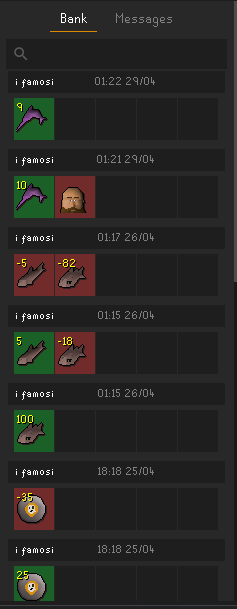
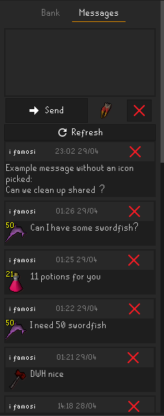
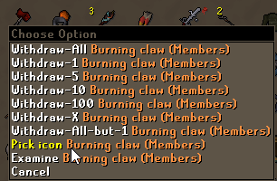
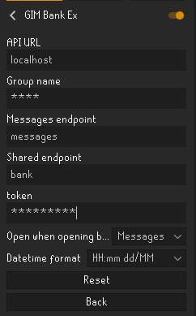

# GIM Bank Extended
A group ironman bank transaction logger and message center.

This plugin needs a server and database to connect to. At the current moment a server is not provided.
Info for self hosting are included below.

 

### Usage:
#### Bank:
Just store / withdraw as you usually do.
Search on item / username and change to next / previous pages on the bottom of the list.
#### Messages:
You send / read messages here.
New messages will be loaded everytime you open the game / shared bank.
You can manually reload messages with the 'Refresh' button.

You can right click an item in the shared bank to pick the icon to add it to your message. If you scroll over the image on the bottom of the message you can change the amount.

## ⚙️ Configuration

- API URL: Url of your server
- Group name: Name of your group, to differentiate in the backend.
- Messages endpoint: Endpoint for the message side of the plugin
- Shared endpoint: Endpoint for the bank transactions of the plugin
- token: Secret token to authenticate your requests
- Open when opening bank: Standard behaviour when opening the shared bank. (Open Messages / Open Transactions / None)
- Datetime format: Format for the date times displayed in both panels.

##  Self hosting:
The host and endpoints can be defined in the plugin config.

The 'Shared endpoint' needs to be able to handle a GET&POST request.
The 'Messages endpoint' needs to be able to handle a GET/POST&DELETE request.

##### Messages:
- id int   
- message text  
- sender varchar(255)  
- item_id int  
- amount int  
- created_at datetime

##### Transactions:

- item_id int  
- item varchar(255)  
- user varchar(255)  
- amount int  
- created_at datetime